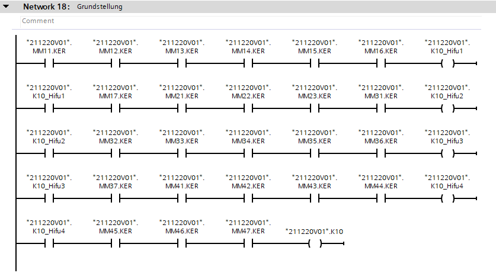

In this chapter will be shown how to create basic logic.

## And

Let's create simple And logic for network "FertigmeldungReset".

```cs
public static IInOutLogicPart FertigmeldungReset(this IPlcClient client, IVass6Station station)
{
    var db = client.GetCodeElement<GeoDb>(station.FullName);

    var k10 = new OpenContact(db.K10);
    var _kt = new CloseContact(db._KT);
    var pf = new OpenContact(db.PF);
               
    k10.ConnectTo(_kt);
    _kt.ConnectTo(pf);
    pf.ConnectTo(new Coil(db.FMReset));
    return k10;
}

public FmLogicPack(IPlcClient client)
{
    FertigmeldungReset.ConnectTo(client.FertigmeldungReset());
}

#region Networks

[Network(TitleText = "de-De:Fertigmeldung Reset")]
public Network<LadCode> FertigmeldungReset { get; private set; }

#endregion
```

On start we take existing GeoDb(data block) for our station and create set of simple contacts.
After definition we connect it together (The way we expect). 
In end we return contact which should be connected to Network Rail.

:::tip
The contact class requires a symbol with the data type "Bool" in the constructor.
:::

## Or

In this sample we just make simple Or (Merge) from two symbols (oRob, A16_SAK) connected directly to PowerRail.

``` cs
public static IEnumerable<IInOutLogicPart> FreigabeMaschinensicherheitHifu(this IPlcClient client, RobotDb db)
{
    var sak = new OpenContact(db.Rob.Type.A.Type.A16_SAK);

    var oRob = new OpenContact(db.Rob.Type.oRob);
    var merge = new Merge(sak, oRob);

    var coil = new Coil(db.Frg_MaschSich);

    merge.ConnectTo(coil);

    yield return sak;
    yield return oRob;
}
```

:::warning
To create merge is required at least two symbols.
:::

## Extension 

### And

``` cs
public ValvesLogicPack(IEnumerable<IValve> valves, GeoDb db)
{
    const ushort maxLogicPartsInChainCount = 7;

    var st_mms = valves.Select(x => db.MM[x].Create(x.Index.ToString()).Type).ToArray();

    var and = st_mms.Select(x => x.KER).And(db.K10_Hifu, db.K10, maxLogicPartsInChainCount).ToArray();

    Home.Code.PowerRail.ConnectTo(and);
}

[Network(TitleText = "de-De:Grundstellung")]
public Network<LadCode> Home { get; private set; }
```

In library exist many extension helper class. 
To our purpose in this sample we create And logic from "KER" symbols.
"db.K10_Hifu" - is container for "help" marker which will be created when is more than "maxLogicPartsInChainCount" in chain.
Follow logic will create something like it.


