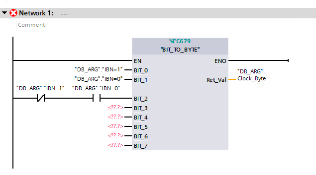

Block from library or code can be called using a extension method. We only just need take it from "IPlcClient" and invoke Call method.

# FC

``` cs
public static IEnumerable<IInOutLogicPart> Sample(IPlcClient client)
{
    var bitToByte = client.GetLibraryElement<BIT_TO_BYTE>();
    var dbArg = client.GetLibraryElement<DB_ARG>();

    var call = bitToByte.Call();
    yield return call;

    //connect directly to input
    call.ConnectToIn(dbArg.IBN_1, x => x.BIT_0);
    call.ConnectToIn(dbArg.IBN_0, x => x.BIT_1);

    //connect as logic chain
    var ibn1 = new CloseContact(dbArg.IBN_1);
    var ibn0 = new OpenContact(dbArg.IBN_0);
    yield return ibn1;
    ibn1.ConnectTo(ibn0);
    call.ConnectFrom(ibn0, x => x.BIT_2);

    call.ConnectReturn(dbArg.Clock_Byte);
}
```

Will create this.



# FB

Calling fb is simmillar to fc, but we only need create idb for it by using extension method Call<..>. 

``` cs
public static IInOutLogicPart Zentralabsaugung(this IPlcClient client, Vass6Plc plc, Zone zone, Suction suction, DB_ARG dbArg, Temp temp)
{
    var zoneDb = client.GetCodeElement<ZoneDb>(zone.FullName);
    var call = client.GetLibraryElement<FB_Absaugung>()
        .Call<Idb>(client, suction.FullName);

    call.ConnectToIn(dbArg.VKE_1, x => x.Freigabe);
    call.ConnectToIn(dbArg.VKE_0, x => x.Ein);
    call.ConnectToIn(dbArg.VKE_0, x => x.Aus);
    call.ConnectToIn(dbArg.VKE_1, x => x.K100);
    call.ConnectToIn(dbArg.IBN_1, x => x.MF20x);
    call.ConnectToIn(dbArg.VKE_0, x => x.BGE20x);
    call.ConnectToIn(new TimeConst(10, 0), x => x.ZUe);
    call.ConnectToIn(new TimeConst(10, 0), x => x.ZAUS);
    call.ConnectToIn(new _2WordConst(1), x => x.Cfg);
    call.ConnectToIn(dbArg.VKE_0, x => x.VkStoe_In);

    call.ConnectToInOut(zoneDb.BA, x => x.ST_BA);

    call.ConnectOutTo(x => x.K20x, suction.MF200);
    call.ConnectOutTo(x => x.KRK20x, temp._Bool);
    call.ConnectOutTo(x => x.PFK20x, temp._Bool);
    call.ConnectOutTo(x => x.Stoe, temp._Bool);
    call.ConnectOutTo(x => x.VkStoe_Out, temp._Bool);

    return call;
}

[Destination(Helper.Arg, Helper.Directory.Vorwahlen, Helper.Directory.Instance)]
[Block(Name = "{0}#" + nameof(FB_Beleuchtung) + Helper.Db,  CommentText = "de-De:Beleuchtung Anlage")]
[Scope(Helper.BlockNameScope.DB.Idb)]
public class Idb : TiaGlobalIdb<FB_Absaugung, _Input, _InOut, _Output, _Static>
{
    public Idb(IPlcClient plcClient, params string[] args) : base(plcClient, args)
    {

    }
}

```

